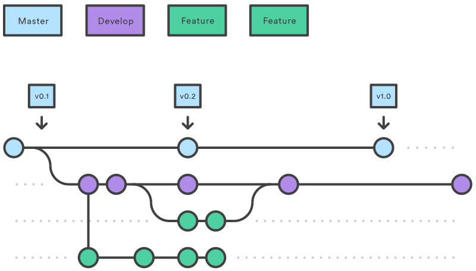

# Git Workflow



_from_ [_atlassian.com/git_](https://www.atlassian.com/git/tutorials/comparing-workflows/gitflow-workflow)

The workflow in use should guarantee that every code in develop is stable to work with and everything in master holds releases (i.e. only features that are playable).

#### 1. Clone the project
You might need to setup a [private and public SSH key pair](https://gitlab.com/help/ssh/README#generating-a-new-ssh-key-pair).
```
git clone git@gitlab.com:tinf17a---software-engineering-ii-project/lifemail.git
```

The default branch is `dev`, but better double check if it is the active branch
```
git branch
```

#### 2. Checkout a branch

If you want to start implementing your own changes you want to work on the according feature branch. There are several ways to achieve this: 

##### Work on an existing branch 

If the branch hasn't existed _before you cloned the repository_ you have the fetch it with  
```
git fetch --all
```
Note that this will not update changes to your local branches. If this isn't enough [regard this](https://stackoverflow.com/questions/10312521/how-to-fetch-all-git-branches).

Once it exists within your local git you can _check out_ the branch which means making it the branch you can actively apply changes to.
```
git checkout <branch_name>
```

##### Create a new branch

```
git checkout -b <new_branch_name>
```

You can link the branch to an existing issue by setting the branch name to `<issue-nr>-issue-description`, e.g. `12-bug-fix`.

Your branch doesn't exist remotely yet, so push it to the according remote branch:

```
git push -u origin <new_branch_name>
```

#### 3. Apply your changes

Keep adding and commiting changes to your local branch.

```
git add file.js                 # just one file
git add .                       # everything in current directory
git add --all                   # any changes
git commit -m "<message>"       # shorthand commit
git push
```

Pushing your local commits to the remote branch might lead to merge conflicts. They can best be solved in a great IDE like VSCode.

Keep applying changes until the feature to be developed is stable.

#### 4. Merge stable Feature back

Once your feature is polished and ready create a merge request online to merge it back into the develop branch.

Once the merge request has been accepted and your feature is finished you can delete the local and remote branch:

```
git branch -d <branch_name>
git push origin --delete <branch_name>
```

